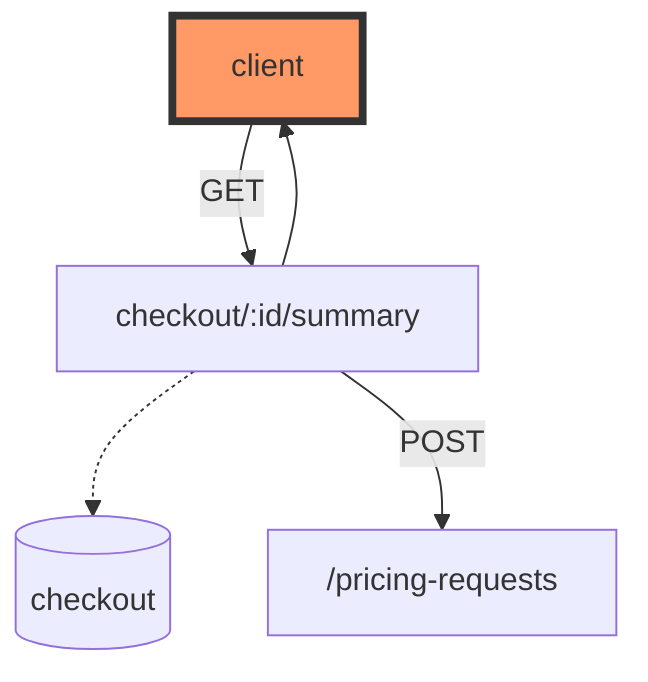
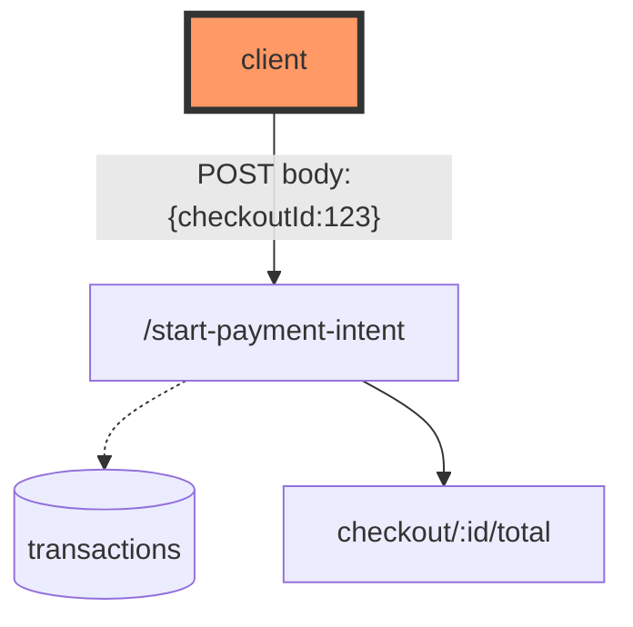

> Customer is on last step of checkout before payment

```mermaid

flowchart TB
    client  --GET--> checkout/:id/summary
    checkout/:id/summary -.-> checkout-table[(checkout)]
    checkout/:id/summary --POST--> /pricing-requests
    checkout/:id/summary --> client


    style client fill:#f96,stroke:#333,stroke-width:4px

```

---

> customer starts payment processing

```mermaid

flowchart TB
    client  --POST body:{checkoutId:123}--> /start-payment-intent
    /start-payment-intent -.-> transactions-table[(transactions)]
    /start-payment-intent --> checkout/:id/total


    style client fill:#f96,stroke:#333,stroke-width:4px

```
