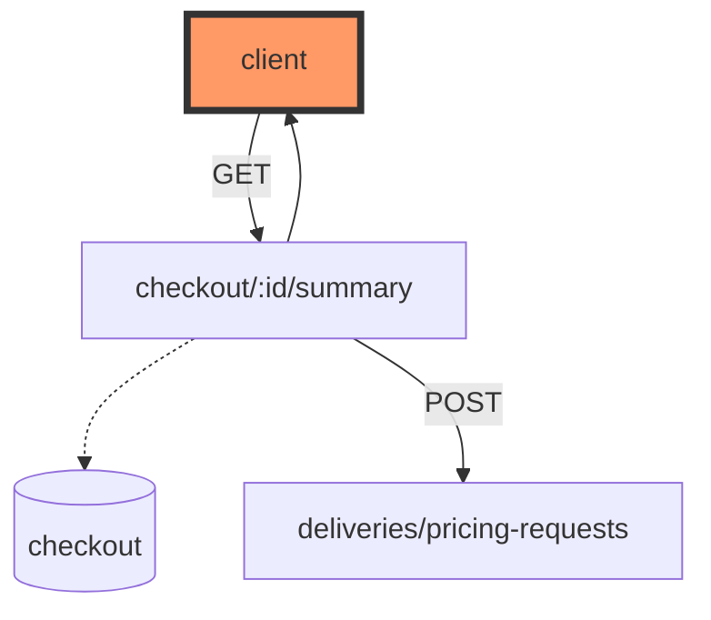
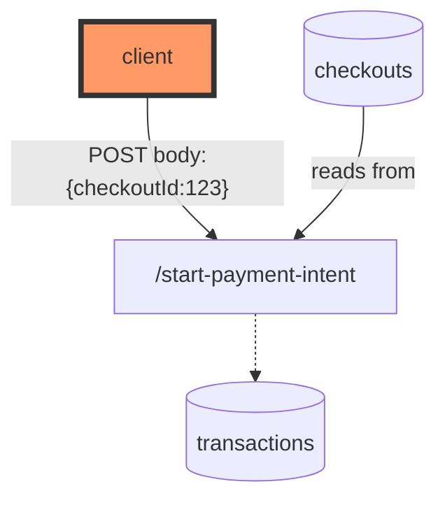
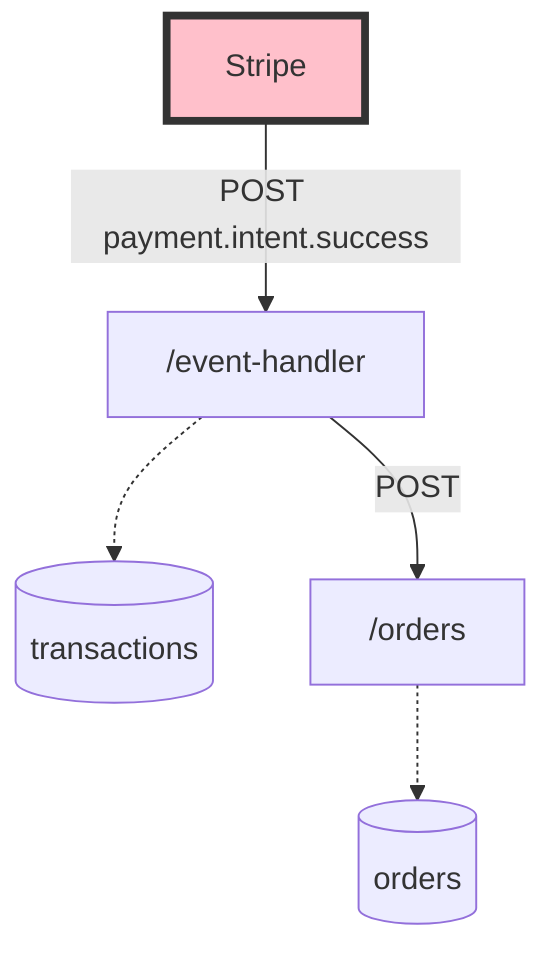

> Customer is on last step of checkout before payment

```mermaid

flowchart TB
    client  --GET--> checkout/:id/summary
    checkout/:id/summary -.-> checkout-table[(checkout)]
    checkout/:id/summary --POST--> deliveries/pricing-requests
    checkout/:id/summary --> client


    style client fill:#f96,stroke:#333,stroke-width:4px

```

---

> customer starts payment processing

```mermaid
flowchart TD
    client  --POST body:{checkoutId:123}--> /start-payment-intent
    /start-payment-intent -.-> transactions-table[(transactions)]
     checkout-table[(checkouts)] --reads from-->  /start-payment-intent


    style client fill:#f96,stroke:#333,stroke-width:4px
```

---

> payment processing successful, order is created and buyer & seller notified

```mermaid

flowchart TD
    Stripe  --POST payment.intent.success--> /event-handler
    /event-handler -.-> transactions-table[(transactions)]
     /event-handler --POST-->  /orders
    /orders -.-> orders-table[(orders)]


    style Stripe fill:pink,stroke:#333,stroke-width:4px

```
